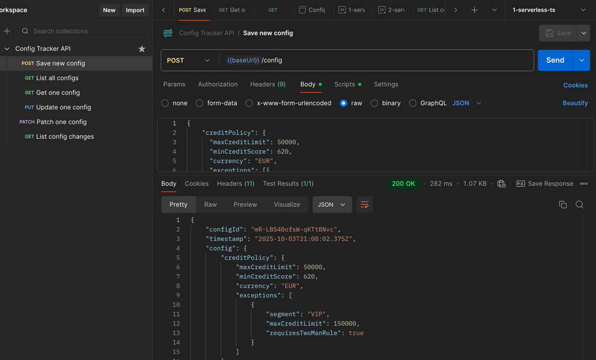

# Config Tracker API - Node.js/TypeScript Lambda Solution

## Prerequisites

- Node.js v22+ (tested with v24.7.0)
- AWS account with admin-level credentials
- [AWS CLI](https://docs.aws.amazon.com/cli/latest/userguide/getting-started-install.html) configured with AWS credentials
- AWS CDK CLI `npm install -g aws-cdk`
  - optional, alternatively prefix all cdk commands with `npx`, e.g. `npx cdk ls`

## Setup

```bash
npm install
cdk bootstrap  # One-time for AWS account/region combination
```

## Development

```bash
cdk ls              # List stacks, good to starts with this command, compiles and runs CDK code
cdk diff            # Preview changes compared to deployed AWS resources
cdk deploy          # Deploy to AWS, both infrastructure and code
cdk destroy         # Clean up AWS resources
```

No build is required after code change, just run:
```bash
cdk deploy
```

To continuously watch and deploy all changes to AWS use:
```bash
cdk deploy --watch
```

After successful deployment you will find output values of API Url and Get API Key command, similar to this:
```bash
Outputs:
config-tracker-1-serverless-ts-stack.RestApiKeyCommand = aws apigateway get-api-key --api-key eyqd3ik2vd --include-value --query 'value' --output text
config-tracker-1-serverless-ts-stack.RestApiUrl = https://0fs78p69e7.execute-api.eu-west-1.amazonaws.com/prod/
```

You can use the AWS command from above output to retrieve the API Key value:
```bash
aws apigateway get-api-key --api-key eyqd3ik2vd --include-value --query 'value' --output text
```

## API Usage

Import the [postman_collection.json](../postman_collection.json) from parent directory into [Postman](https://www.postman.com/) and test all API endpoints. 

It is preconfigured with API Gateway URL and API key of existing AWS deployment.

You test requests in order in which they are defined. Switch environment in top right corner.



Alternatively you can test the API endpoints in terminal using curl:
```bash
# Get API key and endpoint from CDK output or AWS console
export API_KEY="your-api-key"
export API_URL="your-api-gateway-url"

# List configurations
curl "$API_URL/config" -H "x-api-key: $API_KEY"
```

See parent README for additional information.
