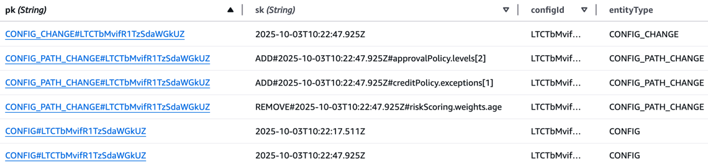

# Assignment

### Scenario:

You’ve joined the Mid-Office team. You’re tasked with creating a configuration change tracker that logs, stores, and retrieves changes to domain-specific rules (e.g., credit limits, approval policies). It should also notify an external monitoring service of any critical changes in cofiguration.

#### Requirements:
- Java 17+ (Java 21 preferred)
- Spring Boot 3.x
- REST API with at least:
    - Create new config change (add/update/delete)
    - List changes by time or type
    - Retrieve specific change by ID
- In-memory persistence (no DB required)
- Input validation with clear error handling
- One simulated external integration (notification or logging)
- Health check endpoint
- Unit + integration tests
- Clear README with rationale, assumptions, and how to run it
- Add infrastructure as a code

#### Config example:
```json
{
  "config": {
    "creditPolicy": {
      "maxCreditLimit": 50000,
      "minCreditScore": 620,
      "currency": "EUR",
      "exceptions": [{
        "segment": "VIP",
        "maxCreditLimit": 150000,
        "requiresTwoManRule": true
      }]
    },
    "approvalPolicy": {
      "twoManRule": true,
      "autoApproveThreshold": 2000,
      "levels": [
        { "role": "TEAM_LEAD", "limit": 10000 },
        { "role": "HEAD_OF_CREDIT", "limit": 50000 }
      ]
    },
    "riskScoring": {
      "weights": {
        "incomeToDebtRatio": 0.4,
        "age": 0.1,
        "historyLengthMonths": 0.2,
        "delinquencyCount": 0.3
      },
      "thresholds": {
        "low": 700,
        "medium": 650,
        "high": 600
      }
    }
  },
  "metadata": {
    "version": 7,
    "effectiveFrom": "2025-09-20T00:00:00Z"
  }
}
```

# Solution

I have decided to use serverless architecture (explained further in lower sections) using different programming languages, TypeScript and Java (as required).

## Architecture


## Rationale

The notification of critical changes in configuration into other services indicates requirement of robust reliability of the solution. This would not be satisfied with simple API service, as the API call can fail due to many reasons (network issues, throttling, service unavailability, security issues, etc.) and in such case we would loose the critical change log and further notification.

Because of that I decided to step back and create an API service as source of truth for storing configurations and use cloud-native serverless solutions to propagate the changes in configurations. However, it can be simplified any time to store only the config changes, as it was requested, as it is already part of the solution although not exposed into API.

### Serverless-first preference

With every greenfield system I first think about possibility of implementation as pure serverless solution, to use optimized cloud-native services, without need to provision extra resources with extra software or container setup and finally being idle for most of the time.

### In-memory persistence requirement

The serverless principle in contradiction with the "In-memory persistence" requirement. As with every serverless solution, we don't have any long-running instances to use their memory as persistence layer. Even with ECS the running container may be replaced theoretically any time, and thus losing all memory persistence.

The only solution I can think of with strict requirement of "in-memory persistence" is single EC2 instance with no autoscaling and no maintenance window, running non-stop.
This would leverage traditional monolithic application using Spring Boot, or any other framework. 


This solution comes with many disadvantages:
- unable to stop or restart EC2 instance, no configuration changes 
- unable to stop or restart Config Tracker application on EC2 instance, no updates or fixes
- lost of in-memory persistence in case of AWS region or AZ outage
- exposure to public internet
  - we would use security group to open only INGRESS port 80 or 443 port
  - putting ALB, NLB, or API GW in front of EC2 would help a bit, but adding complexity and not solving the core problem

However, the low reliability and overall fragility of such solution led me to decision to omit the "in-memory persistence" requirement.  

### Alternatives with other persistence

With other persistence methods we open other possibilities for a solution, including: 
- EC2 with autoscaling (monolith with script)
- ECS Fargate (containerized monolith)
- Lambda (serverless - preferred)

#### Persistence alternatives:
- EFS file storage
- S3 object storage
- any SQL or NoSQL database

With any file or object storage we would need to implement custom format for storing the config and config-change information. And implementing parallel writes in such storage might be quite challenging.

So, not reinventing the wheel I decided to use a database, in this case the **DynamoDB**. We will use **DynamoDB Streams** for event-driven processing of configurations and config changes. 

## Analysis

### Config change

There has been an ambiguity in the definition of what the configuration change is.

There are the domain-specific rules mentioned in the assignment and types of change: add/update/delete.
In further Q/A communication it was clear that a config is a specific JSON object which can be changed on any level.

Example (simplified):
```json
{
  "maxCreditLimit": 50000,
  "minCreditScore": 620,
  "currency": "EUR",
  "exceptions": [{
    "segment": "VIP",
    "maxCreditLimit": 150000,
    "requiresTwoManRule": true
  }]
}
```

changed to:
```json
{
  "maxCreditLimit": 10000,
  "currency": "EUR",
  "exceptions": [{
    "segment": "BONUS",
    "maxCreditLimit": 30000,
    "requiresTwoManRule": false
  }]
}
```

How can we describe the change? In fact, there are multiple changes:
- `maxCreditLimit` changed value from 50000 to 10000
- `minCreditScore` was removed
- `exceptions[0]` was changed to `{ "segment": "BONUS", "maxCreditLimit": 30000, "requiresTwoManRule": false }`, so the old array element was removed and new element was added

We can formalize this change with following data model:

- array of changes as:
    - `type`: one of `ADD`, `UPDATE`, `REMOVE`
    - `path`: a path where the change occured in JSON object
    - `oldValue`: previous value on the JSON path before the change
    - `newValue`: actual value on the JSON path after the change

In our example:
```json
[
  {
    "type": "UPDATE",
    "path": "maxCreditLimit",
    "oldValue": 50000,
    "newValue": 10000
  },
  {
    "type": "REMOVE",
    "path": "minCreditScore",
    "oldValue": 620
  },
  {
    "type": "UPDATE",
    "path": "exceptions[0]",
    "oldValue": {
      "segment": "VIP",
      "maxCreditLimit": 150000,
      "requiresTwoManRule": true
    },
    "newValue": {
      "segment": "BONUS",
      "maxCreditLimit": 30000,
      "requiresTwoManRule": false
    }
  }
]
```

Having previous and actual value of the config, we can calculate the differencies on the fly, and we don't need to require users to call API with this generic changes schema. 

Instead, they can work with domain-specific configurations, which may be validated properly as needed.

With DynamoDB Stream we can catch every change in Config and respond accordingly (calculate differences and notify other services). 

## Solution design

### Use cases

#### API use cases:
- **List configs** - list latest versions of all configurations 
- **Get config by ID** - get latest version of specific configuration by ID
- **Save new config** - save new configuration 
- **Update config** - update existing configuration (replace)
- **Patch config** - partial update of existing configuration (merge)
- **List config changes**
  - by config ID (required)
  - by change type (add, update, remove)
  - by change time (from, to)

#### Downstream use case:
- **Process config change**
  - calculate configuration differences
  - store configuration change
  - notify about configuration change

### Data model

Domain data model consists of `Config` specific data entity (not consulted in detail, as there might be many different options) and `ConfigPathChange` entity describing single change in the configuration.
`ConfigChange` virtual entity (modeled in DB only) consists of multiple `ConfigPathChange` instances and an association to a `Config`.

Database data model enriches the domain entities with DB keys (pk, sk), config ID and timestamp.

For full functionality only `ConfigItem` and `ConfigPathChangeItem` are required. `ConfigChangeItem` can be reconstructed using list of `ConfigPathChangeItem`, it is used only for optimization of DB queries.

For simplicity I have omitted the `version` property of config, as the `timestamp` will be sufficient to distinguish between multiple config instances in this assignment. 


#### DynamoDB single-table design

Although not required, I wanted to showcase DynamoDB single-table design, which is quite common across many DynamoDB use cases.

All entities are stored in single DynamoDB table with proper entity discriminator (`entityType`) and careful design of database keys (`pk`, `sk`).



- Primary Key:
  - `pk` - partition key: `{entityType}#{configId}`
  - `sk` - sort key:
    - `{timestamp}` for `CONFIG` or `CONFIG_CHANGE` entities
    - `{type}#{timestamp}#{path}` for `CONFIG_PATH_CHANGE` entities

Query cases supported by Primary Key:
- query all versions of config by ID - `pk` only
- query `N` latest version of config by ID - sort descending and limit to `N`
- query all config changes by config ID - `pk` only
- query config changes by config ID with filtering by `timestamp`
- query all config path changes by config ID - `pk` only
- query config path changes by config ID and:
  - change `type`
  - change `type` and `timestamp` filtering, including time ranges
  - change `type` and specific `timestamp` (version) and `path` prefix where the change occured

Getting all configurations is performed with DynamoDB `SCAN` operation which is not the best choice in large tables, but is sufficient for this assignment.
In production workload we would need a separate table for top-level configurations or use dedicated GSI (Global Secondary Index) for this use case.

### Serverless handlers

#### Config API handler

Triggered by API Gateway requests:
- `GET /config` - list latest versions of all configurations
- `POST /config` - save new configuration, config ID is generated
- `GET /config/{configId}` - get latest version of a configuration
- `PUT /config/{configId}` - update a configuration (replace)
- `PATCH /config/{configId}` - partially update a configuration (merge)

Validation of `POST` and `PUT` requests is performed by API Gateway by the `Config` domain-specific JSON schema.
The updated configuration (from `POST`, `PUT` and `PATCH` methods) is validated using **ajv** library in TypeScript implementation, right before storing the updated item in DynamoDB.

Response validation is omitted for simplicity, but it can be configured on API Gateway level or on application level.

#### Config Change API handler

Triggered by API Gateway requests:
- `GET /config/{configId}/change` - list configuration changes by config ID and additional criteria, like change type, time range, change path

For strict fulfillment of requirements we can implement additional endpoint:
- `POST /config/{configId}/change` - store the configuration change

#### Config Table Stream handler

Triggered by DynamoDB stream, filtered for only `INSERT` operations and `CONFIG` or `CONFIG_CHANGE` entity types.

For `CONFIG` items there is all the magic happening here:
- fetch latest two instances of a configuration
- calculate differences between two latest configurations, do nothing if equals
- create and save `CONFIG_CHANGE` and `CONFIG_PATH_CHANGE` items

For `CONFIG_CHANGE` items, just publish message to SNS topic, which is standard fan-out pattern for publishing messages to multiple targets.

For more complex processing it would be more suitable to use Step Functions workflow - for better isolation of operations and traceability. But we still need some process to trigger the step function - either another lambda or EventBridge Pipe, which would add an unnecessary complexity for this assignment.

#### Config Notification SQS handler

Triggered by message in SQS queue, which is subscribed to config change SNS topic.
This is just mock handler with logging-only, but any further processing might be implemented here, like calling another service, posting message to a queue or S3 or any other processing.

There was no reason to setup DLQ (Dead Letter Queue) for a logging-only handler, but for real-world workloads it is a convenient method for implementing retry mechanism and alerting. 

SNS topic supports multiple queue subscriptions with different filters, so multiple target systems can react on a change in configuration.

### Notes about security

For this assignment I have defined simple usage plan and API Key on the API Gateway. The API key must be included in every request in `x-api-key` header.

For production workload we would need to consider additional aspects, like:
- is the API called from private network only or via public internet?
- is the API called by human users or by other systems?
- do we already have some existing authentication mechanism?
- do we need some additional authorization for manipulation with config, based by config type, config content or any other aspect?

## Implementation

The implementation codebase consists of:
1. Infrastructure code in AWS CDK 
2. Lambda handlers
3. Domain model
4. Utils to calculate object differences
5. DynamoDB utils

#### 1. Infrastructure code in AWS CDK

AWS CDK (Cloud Development Kit) is AWS native tool for managing cloud resources using Amazon CloudFormation. Other IaC tools could be used as well (Pulumi, SST, Terraform, CDK for Terraform, etc.)
I wanted to stay with AWS-native tool, which handles CloudFormation stacks and can be written in various programming languages, so entire solution can be written in same language.

Main CloudFormation stack consists of nested stacks:
- **storage nested stack** - definition of DynamoDB table, DynamoDB Stream, stream lambda handler and SNS topic
- **api nested stack** - definition of API Gateway, lambda handlers, usage plan and usage key 
- **notifications nested stack** - definition of SQS queue, notification lambda handler

#### 2. Lambda handlers

Lambda handlers are written as pure functions to minimize cold starts and keep the code simple. Once the lambda is instantiated it is kept alive for small number of minutes, so we can expect to handle more requests byt the same instance - so we can apply simple caching patterns.

#### 3. Domain model

Definition of domain data and DynamoDB table entities. In TypeScript as simple interfaces or types, in Java as POJO classes with DynamoDB converters.

#### 4. Utils to calculate object differences

The most complexity is in "calculation of differences". I have used object flattening approach, where the structured object is converted into flat array of key+value pairs, which can be processed further. We can easily compare two flat arrays and recognize added/updated/removed properties.

For convenience I have implemented also merging differences by parent path - if all children of any path have the same type of difference it is reduced into parent path difference.

Due to complexity which was finally higher than expected I have performed only manual testing, but this part would deserve deep unit tests in real-world project.

#### 5. DynamoDB utils

For convenience I have refactored common code into DynamoDB utils, holding DynamoDB client (also reusing between invocations of lambda handler) and acting as simple IaC singleton container.

### `1-serverless-ts` - Node.js/TypeScript Lambda implementation

I have selected Node.js/TypeScript as a reference implementation, since I have been using this combination a lot and the implementation is pretty straight-forward.

Find more details on environment setup and usage in dedicated [README](1-serverless-ts/README.md)

### `2-serverless-java` - Java Lambda implementation

I planned to use Java (21) with Spring Boot (3.5+) in serverless fashion and I have analyzed available options to do so:

1. **Spring Cloud Function**
- native Spring support for serverless functions
- minimal configuration
- good cold start performance
2. **AWS Lambda Web Adapter**
- run Spring Boot as is with minimal changes
- uses lightweight proxy to translate Lambda events to HTTP
- higher cold start times
3. **Spring Native + GraalVM**
- compile Spring Boot to native binary
- fastest cold starts
- more complex build
- limited spring features support
4. **Lambda Container image** 
- package Spring Boot as container image
- better for complex applications
- long cold starts

At first I decided to implement the first option, Spring Boot with Spring Cloud Function.

Although it was functional, I was not satisfied with cold starts about 7 seconds.
It can be found in Git history, but finally I have decided to use pure Java functions without Spring Boot, as there was not much of Spring Boot functionality anyway.

The cold starts are reaching 3 seconds in Java version, which is better but I still consider it quite a long time for a simple service with DynamoDB only.

Find more details on environment setup and usage in dedicated [README](2-serverless-java/README.md)

### `3-ec2-java` - Single EC2 instance Java implementation

For match especially with in-memory persistence requirement I planned also single EC2 Java implementation with traditional Spring Boot, but didn't realize it yet.

### `4-ecs-fargate-java` - Serverless containerized Java implementation

This is suggested solution for Java+Spring Boot, after evaluating Java Lambda implementation.
This is not yet implemented, I can do it. 

## Conclusion

Comparing cold starts, the Node.js/TypeScript handlers are starting in about 1 second.
Lambda memory is defined as 512MB for Node.js and 2048MB for pure Java.
Subsequent calls have all comparable response times.

Although there are techniques how to minimize Java colds starts, like warming lambda functions, provisioned concurrency, SnapStart, GraalVM, code optimalizations, etc., they all introduce increased price or increased complexity to the solution.

So, for synchronous serverless solutions Java is not the fastest and cheapest option available.
With strict Java+Spring Boot requirement, more suitable API-facing solution would be the containerized application running as AWS ECS Fargate service and auto-scaling as needed.