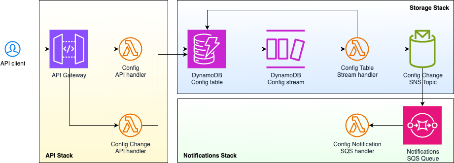
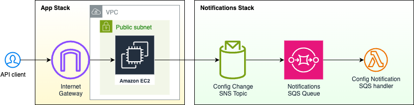
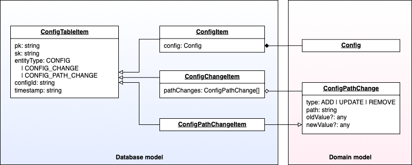

# Assignment

### Scenario:

You’ve joined the Mid-Office team. You’re tasked with creating a configuration change tracker that logs, stores, and retrieves changes to domain-specific rules (e.g., credit limits, approval policies). It should also notify an external monitoring service of any critical changes in cofiguration.

#### Requirements:
- Java 17+ (Java 21 preferred)
- Spring Boot 3.x
- REST API with at least:
    - Create new config change (add/update/delete)
    - List changes by time or type
    - Retrieve specific change by ID
- In-memory persistence (no DB required)
- Input validation with clear error handling
- One simulated external integration (notification or logging)
- Health check endpoint
- Unit + integration tests
- Clear README with rationale, assumptions, and how to run it
- Add infrastructure as a code

#### Config example:
```json
{
  "config": {
    "creditPolicy": {
      "maxCreditLimit": 50000,
      "minCreditScore": 620,
      "currency": "EUR",
      "exceptions": [{
        "segment": "VIP",
        "maxCreditLimit": 150000,
        "requiresTwoManRule": true
      }]
    },
    "approvalPolicy": {
      "twoManRule": true,
      "autoApproveThreshold": 2000,
      "levels": [
        { "role": "TEAM_LEAD", "limit": 10000 },
        { "role": "HEAD_OF_CREDIT", "limit": 50000 }
      ]
    },
    "riskScoring": {
      "weights": {
        "incomeToDebtRatio": 0.4,
        "age": 0.1,
        "historyLengthMonths": 0.2,
        "delinquencyCount": 0.3
      },
      "thresholds": {
        "low": 700,
        "medium": 650,
        "high": 600
      }
    }
  },
  "metadata": {
    "version": 7,
    "effectiveFrom": "2025-09-20T00:00:00Z"
  }
}
```

# Solution

I have decided to use serverless architecture (explained further in lower sections) using different programming languages, TypeScript and Java (as required).

## Architecture



## Rationale

The notification of critical changes in configuration into other services indicates requirement of robust reliability of the solution. This would not be satisfied with simple API service, as the API call can fail due to many reasons (network issues, throttling, service unavailability, security issues, etc.) and in such case we would loose the critical change log and further notification.

Because of that I decided to step back and create an API service as source of truth for storing configurations and use cloud-native serverless solutions to propagate the changes in configurations. However, it can be simplified any time to store only the config changes, as it was requested, as it is already part of the solution although not exposed into API.

### Serverless-first preference

With every greenfield system I first think about possibility of implementation as pure serverless solution, to use optimized cloud-native services, without need to provision extra resources with extra software or container setup and finally being idle for most of the time.

### In-memory persistence requirement

The serverless principle in contradiction with the "In-memory persistence" requirement. As with every serverless solution, we don't have any long-running instances to use their memory as persistence layer. Even with ECS the running container may be replaced theoretically any time, and thus losing all memory persistence.

The only solution I can think of with strict requirement of "in-memory persistence" is single EC2 instance with no autoscaling and no maintenance window, running non-stop.
This would leverage traditional monolithic application using Spring Boot, or any other framework. 



This solution comes with many disadvantages:
- unable to stop or restart EC2 instance, no configuration changes 
- unable to stop or restart Config Tracker application on EC2 instance, no updates or fixes
- lost of in-memory persistence in case of AWS region or AZ outage
- exposure to public internet
  - we would use security group to open only INGRESS port 80 or 443 port
  - putting ALB, NLB, or API GW in front of EC2 would help a bit, but adding complexity and not solving the core problem

However, the low reliability and overall fragility of such solution led me to decision to omit the "in-memory persistence" requirement.  

### Alternatives with other persistence

With other persistence methods we open other possibilities for a solution, including: 
- EC2 with autoscaling (monolith with script)
- ECS Fargate (containerized monolith)
- Lambda (serverless - preferred)

#### Persistence alternatives:
- EFS file storage
- S3 object storage
- any SQL or NoSQL database

With any file or object storage we would need to implement custom format for storing the config and config-change information. And implementing parallel writes in such storage might be quite challenging.

So, not reinventing the wheel I decided to use a database, in this case the **DynamoDB**. We will use **DynamoDB Streams** for event-driven processing of configurations and config changes. 

## Analysis

### Config change

There has been an ambiguity in the definition of what the configuration change is.

There are the domain-specific rules mentioned in the assignment and types of change: add/update/delete.
In further Q/A communication it was clear that a config is a specific JSON object which can be changed on any level.

Example (simplified):
```json
{
  "maxCreditLimit": 50000,
  "minCreditScore": 620,
  "currency": "EUR",
  "exceptions": [{
    "segment": "VIP",
    "maxCreditLimit": 150000,
    "requiresTwoManRule": true
  }]
}
```

changed to:
```json
{
  "maxCreditLimit": 10000,
  "currency": "EUR",
  "exceptions": [{
    "segment": "BONUS",
    "maxCreditLimit": 30000,
    "requiresTwoManRule": false
  }]
}
```

How can we describe the change? In fact, there are multiple changes:
- `maxCreditLimit` changed value from 50000 to 10000
- `minCreditScore` was removed
- `exceptions[0]` was changed to `{ "segment": "BONUS", "maxCreditLimit": 30000, "requiresTwoManRule": false }`, so the old array element was removed and new element was added

We can formalize this change with this data model:
```json
[
  {
    "type": "UPDATE",
    "path": "maxCreditLimit",
    "oldValue": 50000,
    "newValue": 10000
  },
  {
    "type": "REMOVE",
    "path": "minCreditScore",
    "oldValue": 620
  },
  {
    "type": "UPDATE",
    "path": "exceptions[0]",
    "oldValue": {
      "segment": "VIP",
      "maxCreditLimit": 150000,
      "requiresTwoManRule": true
    },
    "newValue": {
      "segment": "BONUS",
      "maxCreditLimit": 30000,
      "requiresTwoManRule": false
    }
  }
]
```

## Entity model


